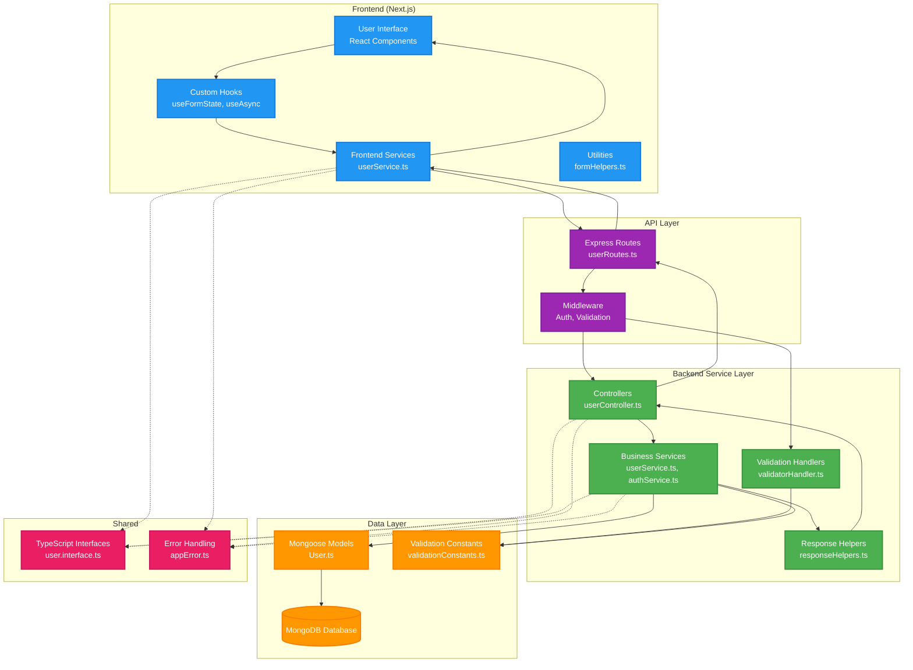
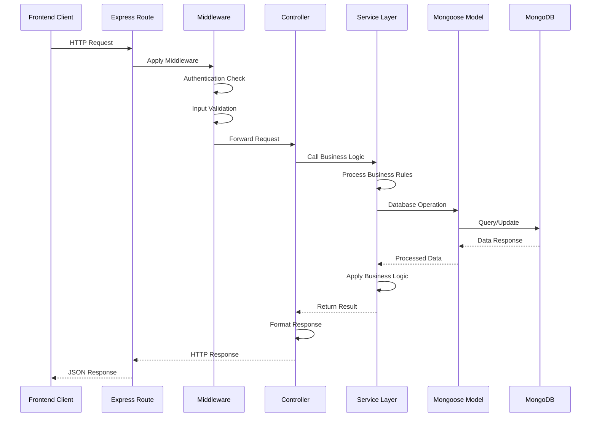
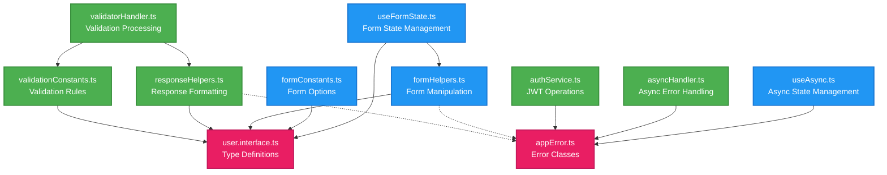

# Language Exchange App - Service Layer Architecture

This document explains the service layer architecture pattern used in our Language Exchange App, showing how requests flow through different layers and how components interact.

## Architecture Overview



## Request Flow Diagram



## Component Responsibilities

### Frontend Layer
- **React Components**: Handle user interactions and display data
- **Custom Hooks**: Manage state and side effects (form state, async operations)
- **Frontend Services**: Handle API communication with backend
- **Utilities**: Helper functions for form handling and data manipulation

### API Layer
- **Express Routes**: Define API endpoints and route HTTP requests
- **Middleware**: Handle cross-cutting concerns (auth, validation, logging)

### Backend Service Layer
- **Controllers**: Handle HTTP requests/responses, coordinate between layers
- **Business Services**: Contain core business logic and domain rules
- **Response Helpers**: Standardize API response formatting
- **Validation Handlers**: Process and format validation errors

### Data Layer
- **Mongoose Models**: Define data structure and database interactions
- **MongoDB**: Persist application data
- **Validation Constants**: Centralize validation rules and error messages

### Shared Layer
- **TypeScript Interfaces**: Ensure type safety across frontend/backend
- **Error Handling**: Consistent error management throughout the app

## Key Benefits of This Architecture

### 1. Separation of Concerns
- Each layer has a specific responsibility
- Changes in one layer don't directly affect others
- Easier to test individual components

### 2. Maintainability
- Business logic is centralized in service layer
- Validation rules are in one place
- Response formatting is consistent

### 3. Scalability
- New features can be added without major refactoring
- Services can be easily extended or replaced
- Database layer is abstracted from business logic

### 4. Testability
- Service layer can be unit tested independently
- Controllers can be tested without database dependencies
- Frontend can be tested with mocked services

## Example: User Registration Flow


## File Structure Mapping

```
backend/
├── src/
│   ├── controllers/         # HTTP request handling
│   │   └── userController.ts
│   ├── services/           # Business logic
│   │   ├── userService.ts
│   │   └── authService.ts
│   ├── utils/              # Helper utilities
│   │   ├── responseHelpers.ts
│   │   └── validatorHandler.ts
│   ├── constants/          # Application constants
│   │   └── validationConstants.ts
│   ├── models/             # Data models
│   │   └── User.ts
│   └── routes/             # API routing
│       └── userRoutes.ts

frontend/
├── src/
│   ├── app/                # Next.js pages
│   ├── hooks/              # Custom React hooks
│   │   ├── useFormState.ts
│   │   └── useAsync.ts
│   ├── services/           # API communication
│   │   └── userService.ts
│   ├── utils/              # Helper utilities
│   │   └── formHelpers.ts
│   └── constants/          # Frontend constants
│       └── apiConstants.ts

shared/
├── user.interface.ts       # Shared TypeScript interfaces
└── appError.ts            # Shared error handling
```

This architecture provides a solid foundation for building scalable, maintainable web applications while keeping the code organized and testable.

## Utility Integration & Cross-Layer Communication

This diagram shows how utilities, helpers, and services communicate across the frontend-backend boundary:

```mermaid
graph TB
    %% Frontend Side
    subgraph "Frontend Ecosystem"
        direction TB
        
        subgraph "React Components"
            RegForm[Registration Form<br/>UI Component]
            LoginForm[Login Form<br/>UI Component]
        end
        
        subgraph "Custom Hooks"
            FormState[useFormState<br/>• handleChange<br/>• resetForm<br/>• setFormData]
            AsyncState[useAsync<br/>• execute<br/>• loading states<br/>• error handling]
        end
        
        subgraph "Frontend Services"
            UserSvc[userService.ts<br/>• registerUser()<br/>• loginUser()<br/>• API calls]
        end
        
        subgraph "Frontend Utils"
            FormHelpers[formHelpers.ts<br/>• setNestedValue<br/>• form manipulation]
            FormConst[formConstants.ts<br/>• field options<br/>• validation rules]
        end
    end

    %% API Boundary
    API[REST API<br/>HTTP/JSON Communication]

    %% Backend Side
    subgraph "Backend Ecosystem"
        direction TB
        
        subgraph "Route Layer"
            UserRoutes[userRoutes.ts<br/>• route definitions<br/>• middleware setup]
        end
        
        subgraph "Middleware Layer"
            ValidMW[Validation Middleware<br/>• express-validator<br/>• input sanitization]
            AuthMW[Auth Middleware<br/>• JWT verification<br/>• user context]
        end
        
        subgraph "Controller Layer"
            UserCtrl[userController.ts<br/>• request handling<br/>• response coordination]
        end
        
        subgraph "Service Layer"
            UserBusiness[userService.ts<br/>• business logic<br/>• data operations]
            AuthBusiness[authService.ts<br/>• JWT management<br/>• token operations]
        end
        
        subgraph "Backend Utils"
            RespHelpers[responseHelpers.ts<br/>• authSuccess()<br/>• error()<br/>• success()]
            ValidHandler[validatorHandler.ts<br/>• async wrappers<br/>• error formatting]
            ValidConst[validationConstants.ts<br/>• rules & messages<br/>• business constraints]
            AsyncHandler[asyncHandler.ts<br/>• error catching<br/>• promise handling]
        end
        
        subgraph "Data Layer"
            UserModel[User Model<br/>• Mongoose schema<br/>• database operations]
        end
    end

    %% Database
    MongoDB[(MongoDB<br/>User Collection)]

    %% Frontend Flow
    RegForm --> FormState
    LoginForm --> FormState
    FormState --> FormHelpers
    FormState --> AsyncState
    AsyncState --> UserSvc
    FormConst --> RegForm
    FormConst --> LoginForm
    UserSvc --> API

    %% Backend Flow
    API --> UserRoutes
    UserRoutes --> ValidMW
    UserRoutes --> AuthMW
    ValidMW --> ValidHandler
    AuthMW --> UserCtrl
    ValidHandler --> UserCtrl
    UserCtrl --> UserBusiness
    UserCtrl --> RespHelpers
    UserBusiness --> AuthBusiness
    UserBusiness --> UserModel
    UserModel --> MongoDB
    
    %% Utility Dependencies
    ValidMW --> ValidConst
    ValidHandler --> ValidConst
    ValidHandler --> RespHelpers
    UserCtrl --> AsyncHandler
    UserBusiness --> AsyncHandler
    
    %% Response Flow
    MongoDB -.-> UserModel
    UserModel -.-> UserBusiness
    AuthBusiness -.-> UserBusiness
    UserBusiness -.-> UserCtrl
    RespHelpers -.-> API
    API -.-> UserSvc
    UserSvc -.-> AsyncState
    AsyncState -.-> RegForm

    %% Styling
    classDef frontend fill:#2196F3,stroke:#1976D2,stroke-width:2px,color:#ffffff
    classDef api fill:#FF5722,stroke:#D84315,stroke-width:3px,color:#ffffff
    classDef backend fill:#4CAF50,stroke:#388E3C,stroke-width:2px,color:#ffffff
    classDef utils fill:#FF9800,stroke:#F57C00,stroke-width:2px,color:#ffffff
    classDef data fill:#9C27B0,stroke:#7B1FA2,stroke-width:2px,color:#ffffff

    class RegForm,LoginForm,FormState,AsyncState,UserSvc frontend
    class FormHelpers,FormConst,RespHelpers,ValidHandler,ValidConst,AsyncHandler utils
    class API api
    class UserRoutes,ValidMW,AuthMW,UserCtrl,UserBusiness,AuthBusiness backend
    class UserModel,MongoDB data
```

## Utility Function Dependencies

Shows the dependency relationships between different utility modules:


