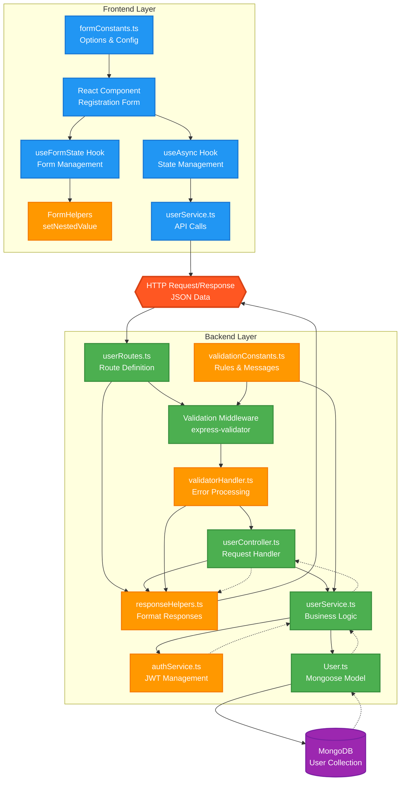
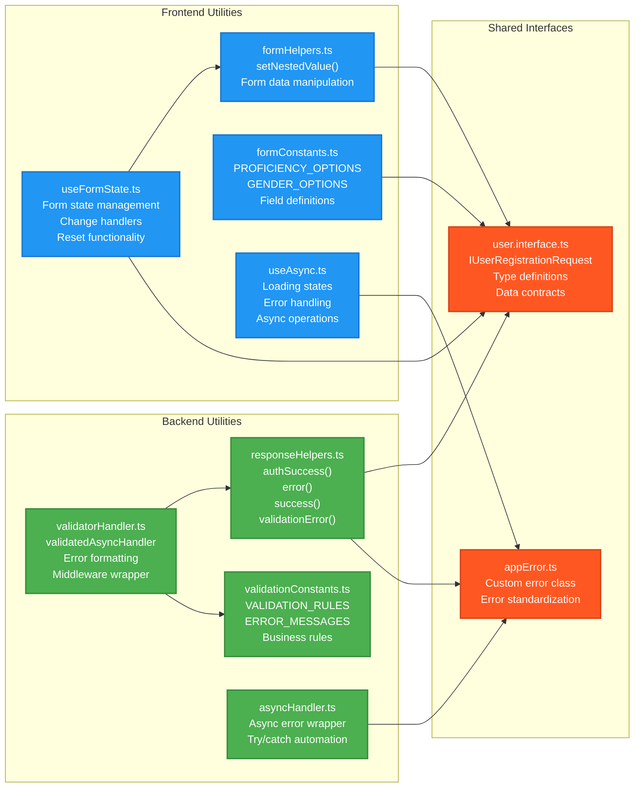
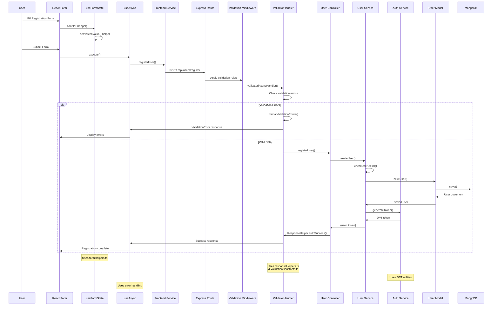
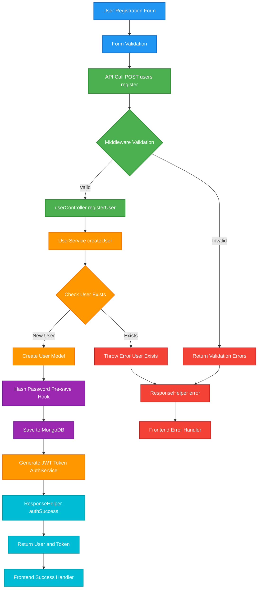
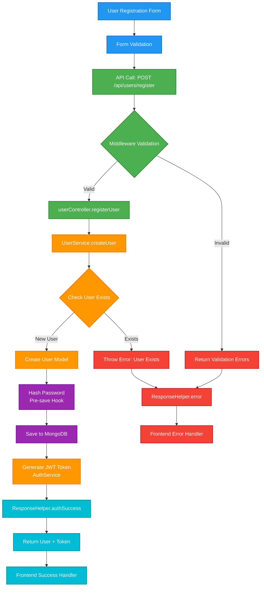
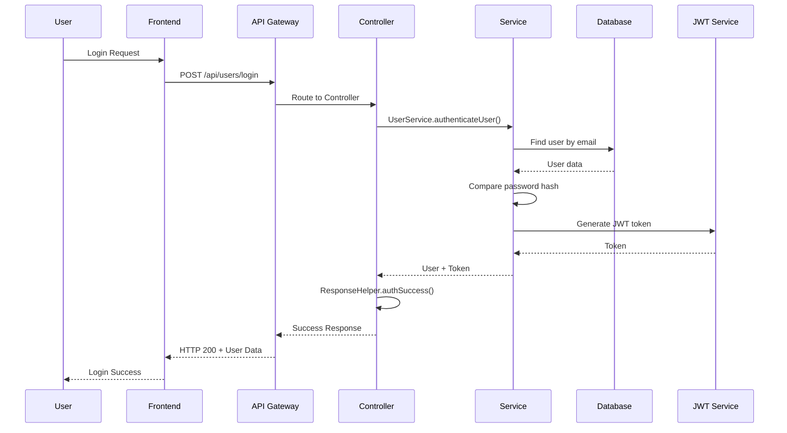
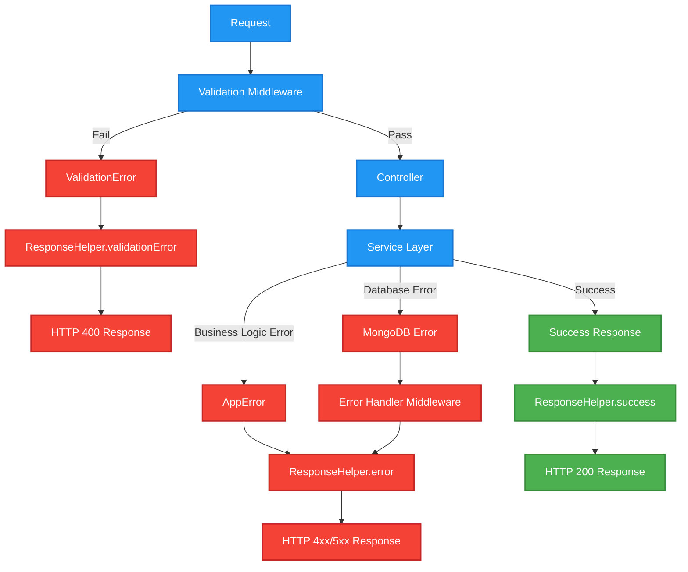

# Core Data Flow - Language Exchange App

This document shows the data flow for our main user operations and how utilities work together across the full stack.

## Frontend-Backend Integration Flow

This diagram shows how utilities, helpers, and services work together across the full stack.



## Utility Functions Integration Map

This shows how different utility functions and helpers are used across the application:



## Complete Request Lifecycle with Utils

This shows a complete request from form submission to database response, highlighting where each utility is used:



## Authentication Flow
```

## Core User Registration Data Flow

This diagram shows the simplified data flow for our main user operations:


```
```
```ore Data Flow - Language Exchange App

This diagram shows the simplified data flow for our main user operations.



## Authentication Flow



## Error Handling Pattern


